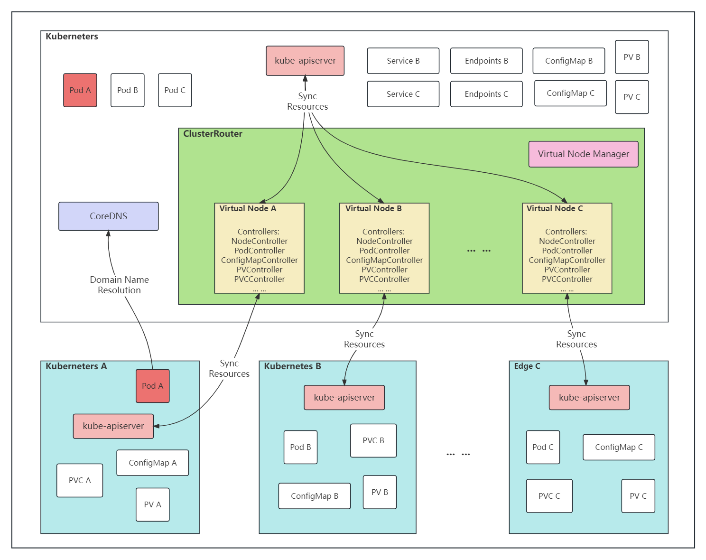

# ClusterRouter

**ClusterRouter 致力于提供一套完整的多集群调度解决方案**

## 关于

ClusterRouter 可以通过将其他Kubernetes集群以Virtual Node的形式与您的Kubernetes集群连接起来，并让他们像在同一个集群一样工作。

**主要功能**:
- **多集群资源整合**：通过ClusterRouter可以将多个集群的资源整合成一个大的资源池，提升处于资源池内所有集群的资源利用率。
- **服务多集群调度**：通过节点亲和等配置提供Pod的多集群调度能力。
- **服务跨集群通信**：原生支持通过Service进行跨集群通信的能力。基于 [clusterlink](https://github.com/kosmos-io/clusterlink) ， 实现不同集群之间的网络通过Pod IP进行互访。
- **便捷化运维集群**：通过设置Virtual Node，可以实现对指定集群进行调度屏蔽。在对指定集群进行升级、变更时，可以省去很多人力成本。
- **原生kubectl能力**：支持原生kubectl的所有操作。运维人员可以方便的在ClusterRouter管理面操作所有下游集群。

## 架构

<div></div>

ClusterRouter 由以下组件组成，各个组件协同工作以实现服务的全局调度：

- **Virtual Node**：通过virtual-node建立上下层集群之间的连接，上层的Pod通过调度器调度到Virtual node，随后将Pod同步到下层集群创建，整个方案对于Kubernetes无侵入。
- **Virtual Node Manager**：管理Virtual Node，控制下游集群的加入和移除。
- **Controller Manager**：运行在Virtual Node中，负责同步上下游集群资源的状态。比如：集群节点新增/删除、Pod状态变化等。

## 快速开始

### 本地启动
#### 1. 将ClusterRouter仓库克隆至本地：
```bash
git clone https://github.com/kosmos-io/clusterrouter.git && make
```
#### 2. 确认跨集群网络是否打通：
```bash
kubectl --context=kind-cluster-host-local exec -it <any-host-pod> -- ping <any-member1-pod-ip>
```
#### 3. 创建与下游集群相对应的Virtual Node：
````bash
kubectl apply -f ./deploy/examples/virtualnode-examples.yaml
````

## 贡献者

<a href="https://github.com/kosmos-io/clusterrouter/graphs/contributors">
  
</a>

Made with [contrib.rocks](https://contrib.rocks).

## License
Copyright 2023 the ClusterRouter Authors. All rights reserved.

Licensed under the Apache License, Version 2.0.
